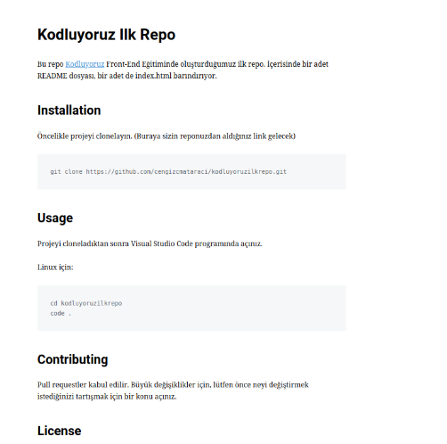

Kodluyoruz Eğitimi Kapsamında Açtığım İlk Repo
# Kodluyoruz İlk Repo
Bu repo [Kodluyoruz](https://kodluyoruz.org/tr/kodluyoruz/) Front-End eğitiminde oluşturduğumuz ilk repo. İçerisinde bir adet README.md dosyası bir adette index.html dosyası barındırıyor.
## İnstallation
Öncelikle projeyi clonelayın. (Buraya sizin reponuzdan aldığınız link gelecek.)
``` 
git clone https://github.com/dygerg/kodluyoruzilkrepo.git 
```
## Usage
Projeyi cloneladıktan sonra Visual Studio Code programında açınız.
Linux için:
```
 cd kodluyoruzilkrepo
 Code .
 ``` 
## Contributing
Pull requestler kabul edilir. Büyük değişiklikler için, lütfen önce neyi değiştirmek istediğinizi tartışmak için bir konu açınız.
## Licence
[MIT](https://app.patika.dev/courses/git/odev1)



